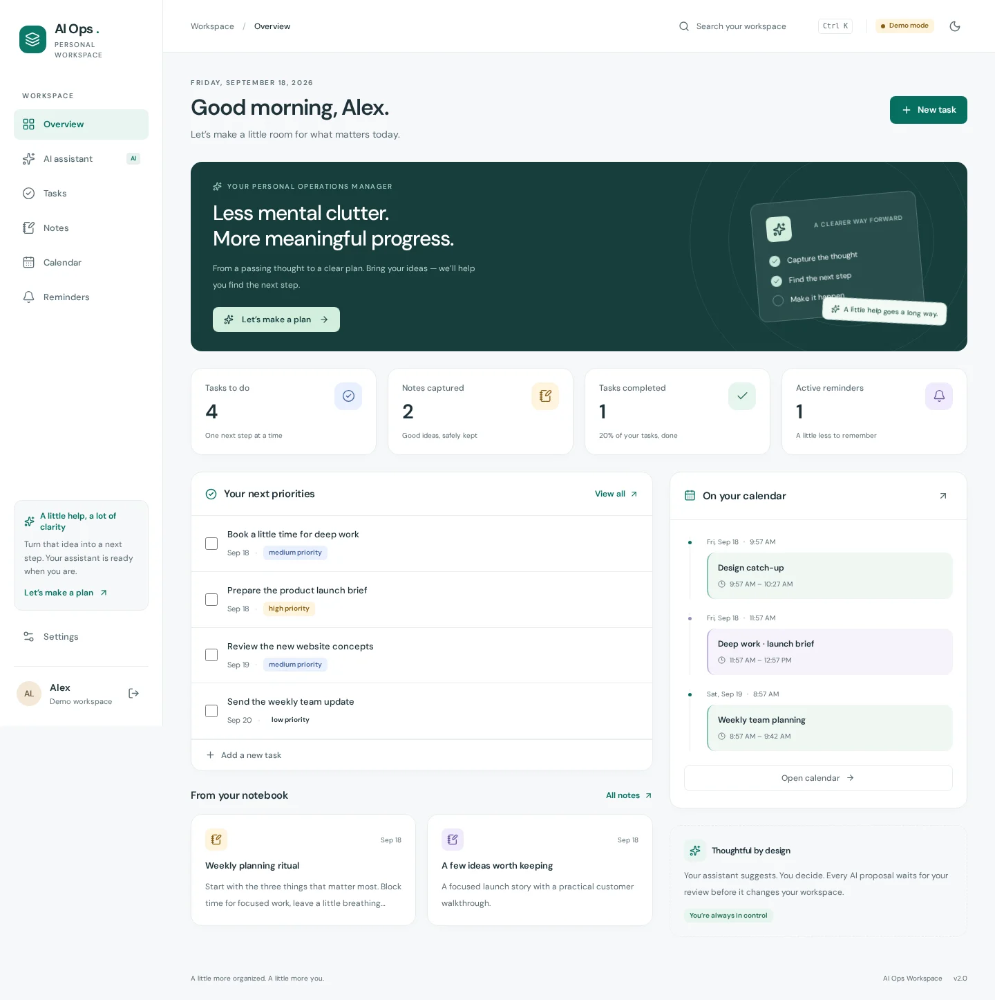

# AI Ops — Personal Operations Manager

A calmer home for your **tasks, notes, calendar, and reminders**, with a multi-agent assistant that turns natural-language requests into **proposals you review before saving**.

Built for the Google Cloud GenAI Hackathon 2026. The project now includes a complete local workspace, explicit Vertex AI integration, transactional PostgreSQL support, and optional aggregate-only BigQuery analytics.

> **No cloud account needed to try it.** The default demo mode uses deterministic local templates, not real AI. It never silently substitutes demo answers for failed cloud requests.



[Mobile preview](docs/assets/workspace-mobile.webp) · [Documentation](docs/README.md) · [Review and remaining launch gates](docs/AUDIT_AND_ROADMAP.md)

## What you can do

- Create, search, edit, complete/reopen, and delete tasks with priorities and optional due dates.
- Capture notes, preserve original content, and review AI summaries/action items.
- Manage events in a responsive calendar with a selected-day agenda.
- Keep in-app reminders, with urgency, due dates, and completion tracking.
- Ask the Planner, Notes, Calendar, or Reminder agent for a structured proposal; **confirm or discard it**. Confirmations are transactional and safe to retry.
- Keep assistant history across reloads. Each request is independent; include the context it needs.
- Use a mobile navigation drawer, keyboard search (`Ctrl/Cmd+K`), dark mode, accessible dialogs, and optional browser dictation.
- Change profile/password settings, export your data, and delete your account.

**Clear boundaries:** no email/push reminder delivery, external Google Calendar sync, email verification, password recovery, or offline synchronization is currently implemented. Cloud availability, budgets, and operational safeguards must be verified before a public launch. See the [production gates](docs/AUDIT_AND_ROADMAP.md#production-launch-gates).

## Quick start

### Requirements

- Python **3.11+** (3.12 is used in containers and CI)
- Node.js **22.12+** and npm
- Optional: Docker Compose v2, PostgreSQL, or Google Cloud credentials

### macOS / Linux

```bash
./run_local.sh
```

### Windows

```powershell
.\run_local.ps1
# Or double-click run_local.bat
```

The launchers install locked dependencies, create local environment files **only if missing**, and start:

- **Workspace:** http://localhost:3000
- **API reference:** http://localhost:8080/docs

Choose **Explore a demo workspace** for a private sample account, or create your own account. Demo accounts do not share credentials or records. Local data lives in the ignored `backend/data/workspace.db` SQLite database. Stopping or restarting the app does not erase it.

For manual setup, alternate ports, or an embedded HTTPS preview, see [Development](docs/DEVELOPMENT.md) and [Configuration](docs/CONFIGURATION.md).

### Docker

```bash
docker compose up --build
```

Open http://localhost:3000. Data survives container replacement in the `workspace-data` volume. **Do not run `docker compose down -v` unless you intend to delete that data.** This Compose file is a local demo, not a production cloud configuration.

## Architecture

```text
Browser ── same-origin /api/v1 ── Next.js server proxy ── FastAPI
                                      │                    ├── PostgreSQL (production)
                           server-only BACKEND_URL         ├── SQLite (local)
                                                           └── Orchestrator → specialist
                                                                  │
                                                          Vertex AI / explicit demo
                                                                  │
                                                        validated review proposal
                                                                  │ confirm
                                                        one database transaction

Scheduled/operator CLI ── aggregate counts only ── BigQuery (optional)
```

- **Frontend:** Next.js 16, React 19, TypeScript, Tailwind, TanStack Query, Radix dialogs.
- **Backend:** FastAPI, Pydantic, SQLAlchemy, Alembic, Argon2id, Google Gen AI SDK.
- **Authentication:** revocable, hashed server-side sessions in HttpOnly cookies; CSRF-protected writes. No browser-localStorage credentials.
- **Storage:** stable UUIDs, tenant-scoped queries, version checks, atomic saves. BigQuery is analytics-only—not an account or task database.

The storage change fixes correctness and uniqueness problems inherent in the old append-only/text-keyed design. [Read the decision](docs/ARCHITECTURE.md#why-operational-data-moved-out-of-bigquery).

## Enable real AI

Configure `backend/.env`:

```dotenv
AI_MODE=vertex
GOOGLE_CLOUD_PROJECT=your-project-id
GOOGLE_CLOUD_LOCATION=us-central1
DEFAULT_MODEL=gemini-2.5-flash
ALLOWED_MODELS=gemini-2.5-flash,gemini-2.5-flash-lite
```

Use Application Default Credentials locally (`gcloud auth application-default login`), or a least-privilege service identity in Cloud Run. **Verify model availability/lifecycle, region, pricing, and quota in your own project.** The configured model list is an allowlist, not live model discovery. Health checks do not spend model tokens.

Try:

- `Plan my week for a product launch`
- `Add task: Review the launch brief`
- `Summarize this meeting: Maya will review the designs. I will collect customer examples.`
- `Schedule a focus session tomorrow at 10am`
- `Remind me to review the brief tomorrow at 9am`

Without Vertex mode, these exercise documented local templates. Unsupported or ambiguous demo dates are not guessed.

## Quality checks

From the repository root, after creating `.venv`:

```bash
.venv/bin/pip install -r backend/requirements-dev.txt
.venv/bin/ruff check backend
.venv/bin/pytest

cd frontend
npm ci
npm run lint
npm run typecheck
npm test
npm run build
npx playwright install --with-deps chromium
npm run test:e2e
```

The configured CI workflow checks both SQLite and PostgreSQL, frontend build/type/lint tests, desktop/mobile browser flows, accessibility, dependency advisories, and OpenAPI documentation drift. See [Testing](docs/TESTING.md) for verified results and environment caveats.

## Production deployment

Start with [Deployment](docs/DEPLOYMENT.md), not the local demo configuration.

```bash
./deploy_gcp.sh             # prints the plan; changes nothing
./deploy_gcp.sh --execute   # only after configuring the required resources/identities
```

Production startup rejects SQLite, demo mode, insecure cookies, and missing migrations. Cloud Run must use a shared PostgreSQL database, secret-backed configuration, and explicit production settings. The deployment script does not create secrets, IAM grants, or databases for you.

**Existing v1 installation?** Read [Migration](docs/MIGRATION.md) before upgrading. The API and storage format are intentionally breaking changes. Previously tracked account hashes must be treated as exposed; they are not imported into v2.

## Repository map

```text
backend/       API routes, agents, transactional models, migrations, scripts, tests
frontend/      App Router pages, shared UI, typed API client, browser/unit tests
docs/          Architecture, API, setup, deployment, security, operations, migration
.github/       CI and dependency-update configuration
compose.yaml   Persistent local container demo
cloudbuild.yaml / deploy_gcp.*   Explicit Google Cloud deployment scaffolding
```

The original presentation/video assets are retained for hackathon evaluation. Runtime databases, backups, logs, credentials, and build output are ignored.

## License

The repository's existing [LICENSE](LICENSE) is unchanged: **All Rights Reserved**, for viewing/evaluation under its stated terms. This project is not presented as open-source licensed. Third-party components retain their own licenses; see [notices](docs/THIRD_PARTY_NOTICES.md).
